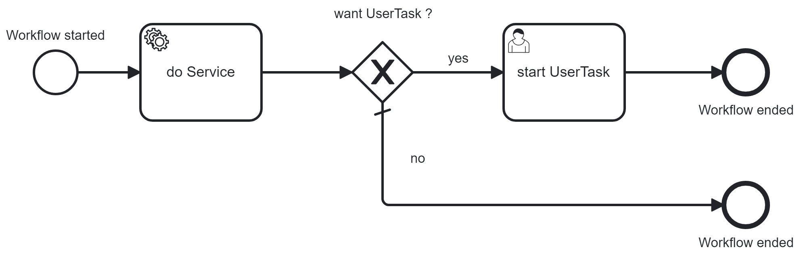

# blueprint-workflowmodule-springboot-standalone-businesscockpit

A **blueprint** of a standalone Spring Boot application including the **[Vanillabp Business Cockpit](https://github.com/vanillabp/business-cockpit/tree/feature/documentation)**
demonstrating how to use [VanillaBP SPI](https://github.com/vanillabp/spi-for-java) and the [Business Cockpit SPI](https://github.com/vanillabp/business-cockpit/tree/feature/documentation/spi-for-java) for BPMN-based workflows. This
example covers a very minimal set of scenarios for developing business process applications and serves as a starting
point for more complex use cases.

This blueprint is an extension from the standalone project and therefore doesn't have all the details when it comes to
the processes and tasks itself. To see all those details
[click here](https://github.com/vanillabp/blueprint-workflowmodule-springboot-standalone/tree/wip).



## Getting Started

1. **Create an empty project and run:**
   ```shell
    mvn archetype:generate
    -DarchetypeGroupId=io.vanillabp.blueprint
    -DarchetypeArtifactId=workflowmodule-springboot-standalone-businesscockpit-archetype
    -DgroupId={your.groupId}
    -DartifactId={your.artifactId}
    -Dversion={your.version}
    ```
   *Hint:* If you want a specific verison add `-DarchetypeVersion={e.g 0.0.1}`
2. **Build the Project**
   ```shell
   mvn clean install
    ```
3. **Start the Project**
   ```shell
   java -jar /target/demo.jar --spring.profiles.active=camunda7
   ```
To start the project with the `camunda8` profile see this [specific README](https://github.com/vanillabp/blueprint-workflowmodule-springboot-standalone/blob/wip/CAMUNDA8.md)

## Business cockpit

For the VanillaBP Business Cockpit to work follow the [As-Is Guide](https://github.com/vanillabp/business-cockpit/blob/feature/documentation/container/README.md#as-is).

Here a simplified version:
1. In the development package of the business-cockpit project:
    ```shell
    docker compose up -d
    ```
2. Add `127.0.0.1 business-cockpit-mongo` to your local hosts file.
3. Download the container-JAR, rename it to bc.jar and put it into this project.
4. Start the bc.jar:
    ```shell
    java -jar bc.jar
    ```
5. Authenticate with `test` as username and password under [http://localhost:8080/](http://localhost:8080/)
6. Start the standalone-businesscockpit application, and you should be able to see your workflow and your task in the respective Lists.

## Web app

To know more about the webapp [click here](./WEBAPP.md)

## Noteworthy & Contributors

VanillaBP was developed by [Phactum](https://www.phactum.at) with the intention of giving back to the community as it
has benefited the community in the past.\


## License

Copyright 2025 Phactum Softwareentwicklung GmbH

Licensed under the Apache License, Version 2.0
