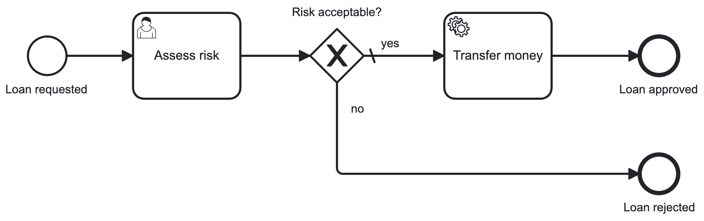

# Blueprint "Standalone leveraging Business Cockpit"

A **blueprint** of a standalone Spring Boot application leveraging the
**[VanillaBP Business Cockpit](https://github.com/vanillabp/business-cockpit/)**
demonstrating how to use the [VanillaBP SPI](https://github.com/vanillabp/spi-for-java) and
the [VanillaBP Business Cockpit SPI](https://github.com/vanillabp/business-cockpit/tree/feature/documentation/spi-for-java) for
BPMN-based workflows. The Business Cockpit is a web application for
business users to fulfill user tasks as part of a workflow
as well as for providing business data of running workflows.

This blueprint is an extension of the
["Standalone" blueprint](https://github.com/vanillabp/blueprint-workflowmodule-springboot-standalone)
and therefore descriptions do not cover details already explained there.

Available variants:
1. [Using MongoDB instead of JPA](https://github.com/vanillabp/blueprint-workflowmodule-springboot-standalone-businesscockpit/tree/variant/mongodb)

In order to develop a better understanding of how to use VanillaBP,
a concrete technical process “loan approval” is used instead of an abstract
demo process. This
example covers a very minimal set of scenarios for developing business process
applications and serves as a starting
point for more complex use cases:



## Getting Started

1. **Create an empty project directory and run:**

   ```shell
   mvn archetype:generate \
   -DarchetypeGroupId=io.vanillabp.blueprint \
   -DarchetypeArtifactId=workflowmodule-springboot-standalone-businesscockpit-archetype \
   -DgroupId={your.groupId} \
   -DartifactId={your.artifactId} \
   -Dversion={your.version}
   ```

   *Hint:* If you want a specific archetype version add `-DarchetypeVersion={e.g 0.0.1}`
   <br>&nbsp;

2. **Build the application:**

   ```shell
   mvn clean package -Pcamunda7
   ```
3. **Start the VanillaBP Business Cockpit:**   
   Details in chapter [Using the demo](#using-the-demo)
   <br>&nbsp;
4. **Start the application:**

   ```shell
   java -jar target/loan-approval.jar --spring.profiles.active=camunda7
   ```

## Using the demo

This demo provides UI components for completing the loan approval
workflow, including user tasks.
Those UI components are meant to be shown as part of the
VanillaBP Business Cockpit.
Therefore, the
[Business Cockpit needs to be available](#running-the-business-cockpit)
while using the demo.
As a simpler alternative you may [run the
Business Cockpit DevShell](#running-the-business-cockpit-devshell)
instead, which is a replacement of the Business Cockpit typically used for
simplified local development of those UI components.

To go through the entire loan approval follow these steps:

1. Start processing of loan approval using this URL:<br>
   [http://localhost:8080/api/loan-approval/request-loan-approval?loanAmount=1000](http://localhost:8080/api/loan-approval/request-loan-approval?loanAmount=1000)<br>
   As a result you will get the loan approval's request ID needed in subsequent URLs.
2. Open Business Cockpit or DevShell:
   1. In the Business Cockpit: Change to list of user tasks and select the task "Assess risk".
   2. In DevShell:
      1. Checkout logs or the h2 database for retrieving the ID of the user task `Assess risk`.
      2. Enter the user task ID in the web application to load the task
3. Complete or save the user task by using the UI loaded.
4. The service task "Transfer money" is executed depending on the value chosen for `riskAcceptable`.

*Hints:*
- To see currently running processes or user tasks use [your local Camunda 7 Cockpit](http://localhost:8080/camunda).
- For running this demo using Camunda 8 checkout [Camunda 8 README](./CAMUNDA8.md#setup-instructions).

## Interesting to know

The default Maven profile is `camunda7`, which includes the [Camunda 7 adapter](https://github.com/camunda-community-hub/vanillabp-camunda7-adapter) dependency
and the [Camunda 7 Business Cockpit adapter](https://github.com/vanillabp/business-cockpit/tree/main/adapters)
dependency.
Additionally, a Spring profile `camunda7` needs to be used at runtime providing proper configuration.
For **Camunda 8** the respective profile `camunda8` has to be used.
Refer to the [specific README](./CAMUNDA8.md) since additional setup is required.

The blueprint implements two main patterns typical to VanillaBP applications
integrating into a Business Cockpit:

1. How to store data entered into user task forms.<br>Find this pattern
   [explained in detail here](./FORMDATA.md).
2. How to integrate UI (like user tasks) hosted by a (micro-)service
   into a Business Cockpit UI instead of providing a separate UI per (micro-)service.
   <br>This pattern is
   [explained in detail here](./WEBAPP.md).

This blueprint is about a single [workflow module](https://github.com/vanillabp/spring-boot-support#workflow-modules).
If you are interested in implementing multiple workflow modules, you should take a look at other blueprints that cover
those scenarios.

Other concepts VanillaBP is based on can be found in [VanillaBP SPI documentation](https://github.com/vanillabp/spi-for-java#concept).

## Building an application for your own use case

If you want to use the project generated based on this archetype
as a base for your use case, then

1. choose a proper identifier for your business use case.
2. rename the Java package `blueprint.workflowmodule.standalone.loanapproval` according to your
   projects package and use case identifier (e.g. `com.mycompany.myusecase`).
3. search case-insensitive in all files for all occurrences of
   `loanapproval` or `loan-approval` and replace it by the identifier of your
   use case.
4. search case-insensitive in all files for all occurrences of
   `assessrisk` or `assess-risk` and copy and replace it by the identifier of your
   `use case` user tasks.
5. place your BPMN file in the directory
   `src/main/resources/processes/camunda7` and change the annotation `@BpmnProcess`
   found in Java class `service` pointing to your BPMN file's name.

## Running the Business Cockpit

Instructions at a glance:

1. Follow the
   [detailed instructions](https://github.com/vanillabp/business-cockpit/tree/main/container#as-is)
   which are:
   1. Run a local MongoDB database.
   2. Download the prebuilt JARs.
   3. Run the Simulator JAR.
   4. Run the Business Cockpit JAR using port `9080` to avoid conflicts with the blueprint demo application:

      ```shell
      java -Dserver.port=9080 -Dspring.profiles.active=local -jar bc.jar
      ```
   5. Open [local Business Cockpit](http://localhost:9080) in Browser and login with user `test` (pwd: `test`).
2. The blueprint needs to be started with additional parameter pointing the REST
   endpoint to the Business Cockpit instead of the DevShell Simulator:

   ```shell
   java -Dvanillabp.cockpit.rest.base-url=http://localhost:9080 -jar target/loan-approval.jar --spring.profiles.active=camunda7
   ```

## Running the Business Cockpit DevShell

The DevShell is a tiny web application used for local development of user tasks
and other workflow specific UIs. It mimics the situation of integrating those UI
components into the VanillaBP Business Cockpit and handing over data about the user task.

Data shown by the Business Cockpit is automatically reported by the VanillaBP
Business Cockpit adapter when a workflow is started or a user task is created.
On loading a workflow's or a user task's UI in the DevShell, this data previously
reported needs to be fetched for UI initialization. Since the VanillaBP
Business Cockpit is typically not running for local development, one can run the
[DevShell Simulator](https://github.com/vanillabp/business-cockpit/tree/main/development/dev-shell-simulator)
instead. It provides all Business Cockpit APIs required for data reporting and
retrieval.

Instructions at a glance:

1. Download runnable JAR from
   [Maven-Central](https://central.sonatype.com/artifact/io.vanillabp.businesscockpit/dev-shell-simulator)
   or the latest [snapshot](https://github.com/orgs/vanillabp/packages?q=dev&tab=packages&q=dev-shell-simulator).
2. Run the JAR passing the [predefined user configuration](./dev-shell-users.yaml) file:

   ```shell
   java -jar dev-shell-simulator-*-runnable.jar --spring.config.additional-location=./dev-shell-dev-shell-users.yaml
   ```
3. In this demo project open directory `src/main/webapp` in terminal.
4. Install NPM packages required:

   ```shell
   npm install
   ```
5. Start DevShell:

   ```shell
   npm start
   ```
6. In the DevShell, available at [http://localhost:3000](http://localhost:3000),
   one can load workflow pages and user tasks by entering the respective ID of the
   business processing engine used. Additionally, the UI can be tested with different
   users by selecting the user from the drop-down list provided.

*Hint:* Since the
[DevShell Simulator](https://github.com/vanillabp/business-cockpit/tree/main/development/dev-shell-simulator)
stores data only in-memory, it has to be started before starting local testing (e.g. starting a workflow) and must
not be restarted during tests. Otherwise, workflows or user tasks reported before are not available anymore.

## Noteworthy & Contributors

VanillaBP was developed by [Phactum](https://www.phactum.at) with the intention of giving back to the community as it
has benefited the community in the past.\


## License

Copyright 2025 Phactum Softwareentwicklung GmbH

Licensed under the Apache License, Version 2.0
